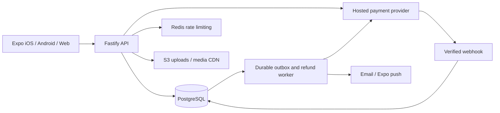

# CRW+ architecture

## Runtime

The Expo 57 app runs React Native on iOS/Android and React Native Web for preview. React Navigation supplies the four tabs and native detail stacks. TanStack Query handles remote state, errors, cache invalidation and refresh. Native session tokens are held in SecureStore; browser sessions use HttpOnly cookies. App deep links use the `crw` scheme, while web links use `?event=`, `?booking=`, `?verify=` and `?reset=`.

Fastify 5 exposes the API. PostgreSQL is authoritative. Development uses persistent PGlite, an embedded PostgreSQL engine, with a serialized connection; production requires `DATABASE_URL` and uses a connection pool with real PostgreSQL transactions and row locks. PGlite is never accepted as the production database.

## Domain boundaries

- `routes/auth.ts`: registration, login, verification, password reset, revocable sessions.
- `routes/discovery.ts`: database filters, time zones, geospatial distance, search, attendee visibility and discovery statistics.
- `bookings.ts`: row-locked inventory, immutable price snapshots, checkout, settlement, cancellation, refunds, tickets.
- `routes/booking.ts`: booking ownership, QR check-in authorization and webhook parsing.
- `competition.ts`: authoritative XP ledger, trusted attendance rewards, exploration, achievements and challenge progress.
- `routes/compete.ts`: individual leaderboards, active seasons and challenge enrollment.
- `routes/social.ts`: profiles, follows, blocking, privacy, reactions, notification inbox and account removal.
- `routes/management.ts`: organizer applications and approval, scoped event management, uploads, audited admin configuration and payouts.
- `worker.ts`: reservation expiration, resumable event cancellation, refunds, notification delivery, global/city/country rank snapshots and season finalization.

## Security model

All roles are loaded from the database for each authenticated request. Normal users cannot call organizer/admin handlers. Organizer membership checks require an active, verified community. Application approval is an admin transaction that records the review, creates a community and grants membership. Suspension removes access; hiding frontend controls is only a presentation choice.

Passwords use salted scrypt. Sessions and single-use verification/reset tokens are random opaque values stored only as SHA-256 hashes. Reset revokes existing sessions. HTTP responses use security headers; state-changing browser requests reject unapproved origins. Production cookies require HTTPS. Production rate limits share Redis. Sensitive headers are redacted from logs.

Tickets use a secret-derived unguessable token; the database stores only its hash. Check-in requires a confirmed, unrevoked ticket, membership in its organizer, a valid time window, and a unique ticket/event-user check-in. XP and audit tables reject UPDATE and DELETE through triggers. Reward idempotency keys prevent duplicate XP.

Privacy filters remove private/blocked people from attendee lists, public search and rankings. Organizer guest lists remain scoped operational records for their events. Aggregate activity counts do not disclose identities. Account deletion anonymizes the public identity, disables ranking, revokes sessions and removes push tokens while preserving financial integrity records.

## Data and scale

The migration includes normalized tables, foreign keys, checks, unique constraints, discovery indexes, geospatial coordinate indexes, search GIN index and XP covering indexes. Money and XP use integer units. Time is stored as UTC timestamptz, with IANA city time zones for local day/tonight filtering. Weekly/monthly leaderboards currently use UTC boundaries.

Leaderboard scores aggregate the ledger at query time, with pagination, current-user position, nearby competitors and nullable historical rank movement. Global/city/country snapshots and finalized season placements are generated by the worker. Personalized Friends snapshot generation remains an extension. Empty historical movement is returned as null, never invented.

At higher scale, add ledger-derived materialized aggregates, full-text search ranking, PostGIS, cursor pagination and a dedicated worker deployment. Current LIKE search is parameterized and functional; its GIN index is reserved for a full-text rollout rather than falsely described as accelerating LIKE queries.

## Mobile capabilities and limits

Haptic interactions, reduced-motion-aware press/progress animation, native stack transitions, safe areas, keyboard handling, refresh controls, camera QR scanning, image upload, sharing, deep links, native maps and Expo push registration are implemented. The web map uses Leaflet/CARTO tiles and clusters nearby markers. Native maps use Apple Maps/Google Maps with spatial marker clustering. A native device build, permission-denial testing, push credentials and store signing remain release tasks.

The development dataset and cached imagery are visibly labeled. No development seed is invoked at production startup. Production media uses scoped, expiring S3 PUT URLs with allowlisted image MIME types and signed content length. Configure a CDN with correct image content types and `nosniff`; a media scanning/quarantine service is an additional production hardening step.
